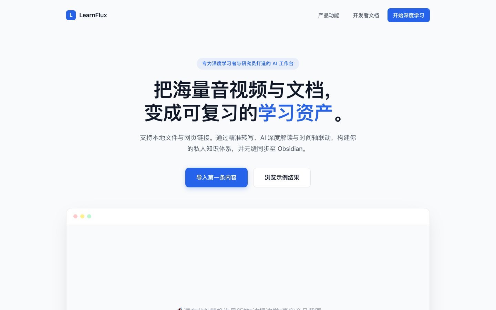

# LearnFlux

> 把视频、音频和文档，变成可理解、可追问、可复习、可沉淀的学习资产。

LearnFlux 是一个可自托管的 AI 学习工作台。它把平台链接、本地音视频、文档或已有文本推进成一条完整学习链路：

**导入 → 转录 / 解析 → AI 校对与解读 → 边播边学 / 心流阅读 → 图解与笔记 → 定期复盘 → Obsidian 沉淀**

<p align="center">
  
</p>

[](https://www.python.org/downloads/)
[](https://fastapi.tiangolo.com/)
[](LICENSE)

## 为什么用 LearnFlux

- **不止拿到字幕**：保留时间轴，生成校对稿、总结、难点解释、问答和视觉图解。
- **支持多种来源**：YouTube、Bilibili、抖音、小红书、小宇宙、微信视频号、音视频直链、本地文件和文档。
- **把内容组织成体系**：支持单篇学习、系列课程、知识地图、心流阅读和心流写作。
- **从学习走向行动**：提供今日、周度、月度、年度复盘，记录证据、洞察与可验证的行动实验。
- **数据由自己掌控**：默认使用本地 SQLite 和文件系统，也可迁移到 PostgreSQL；笔记可同步到 Obsidian。
- **可被 Agent 调用**：仓库内置 agentskills.io 标准 skill，可供 Claude Code、OpenClaw、Hermes 等工具调用。

LearnFlux 更适合个人学习者、内容研究者和希望自托管知识工作流的开发者。它不是开箱即用的多租户商业 SaaS，目前也不包含计费、完整团队权限和托管式 GPU 转录服务。

## 快速开始

### 1. 准备环境

推荐环境：

- Python 3.11+
- Git 与可访问依赖源的网络
- macOS 或 Linux；Windows 推荐 Docker / WSL，也可手动安装 Python 依赖和 FFmpeg
- 至少一种可用的转录方式，见[转录引擎怎么选](#转录引擎怎么选)

初始化脚本会安装项目依赖、检查 FFmpeg，并且只在配置不存在时创建 `config/config.jsonc`，不会覆盖已有配置。

```bash
git clone https://github.com/zhangxun-ai/LearnFlux.git
cd LearnFlux
bash scripts/bootstrap.sh
```

Apple Silicon Mac 可以同时安装本机 `mlx-whisper`：

```bash
bash scripts/bootstrap.sh --with-local-whisper
```

说明：macOS 自动安装 FFmpeg 需要先有 Homebrew；Linux 自动安装需要 `apt-get` 和 `sudo`。如果你已经准备好依赖，也可以只运行：

```bash
uv sync --extra dev
```

### 2. 设置管理口令

先编辑 `config/config.jsonc`，把示例口令换成你自己的强随机字符串：

```jsonc
"api": {
  "port": 8000,
  "host": "0.0.0.0",
  "auth_token": "replace-with-a-long-random-token",
  "ui_lab_enabled": false
}
```

可以用下面的命令生成随机口令：

```bash
openssl rand -hex 32
```

`api.auth_token` 必须先在配置文件中设置。系统设置页会用它验证管理员身份，但不会替你创建或修改这个口令。

### 3. 选择转录方式

Apple Silicon Mac 使用本机转录时，在 `config/config.jsonc` 中启用：

```jsonc
"local_whisper": {
  "enabled": true,
  "binary": "~/.venvs/mlx-whisper/bin/mlx_whisper",
  "model": "mlx-community/whisper-large-v3-turbo",
  "language": "",
  "timeout": 1800
}
```

其他环境需要连接 CapsWriter、按需连接 FunASR，或显式启用云端 ASR。服务本体不会自动部署这些独立转录服务。

### 4. 启动并检查

macOS / Linux 后台运行：

```bash
./server.sh start
./server.sh status
curl -s http://localhost:8000/health
```

前台运行或 Windows 手动运行：

```bash
uv run python main.py --start
```

默认入口：

- Web：<http://localhost:8000>
- 健康检查：<http://localhost:8000/health>
- Swagger API 文档：<http://localhost:8000/docs>

健康检查返回 `"status": "healthy"` 表示核心服务可用。`optional_unhealthy` 中只出现未启用的 FunASR 等可选能力时，不影响不带说话人识别的基础流程。

### 5. 完成第一次学习

1. 打开 <http://localhost:8000/settings>，输入刚设置的管理口令。
2. 配置 LLM 的 API Key、Base URL 和模型；需要抖音、小红书等社媒能力时再配置 TikHub。
3. 修改配置后执行 `./server.sh restart`。
4. 打开 **单篇深度学习**，粘贴公开链接、上传本地音视频，或粘贴已有文本。
5. 第一次先关闭说话人识别，选择本地免费路径，缩短排查链路。

成功标志：

- 任务从排队 / 处理中进入成功状态
- 结果页出现可阅读的逐字稿
- 配置了 LLM 后出现校对稿、总结或解读
- 音视频内容可以在“边播边学”中按时间轴联动

## 转录引擎怎么选

| 方案 | 适合场景 | 优点 | 使用前需要 |
| --- | --- | --- | --- |
| `local_whisper`（mlx） | Apple Silicon Mac 个人使用 | 数据留在本机，不依赖独立 ASR 服务 | `bootstrap.sh --with-local-whisper` 并启用配置 |
| CapsWriter | Linux、Windows、局域网服务器 | 通用音频转录，可独立扩容 | 自行部署可访问的 CapsWriter WebSocket 服务 |
| FunASR 说话人识别 | 访谈、会议、圆桌 | 区分不同说话人 | 自行部署 FunASR 服务；只在需要时勾选 |
| `cloud_asr` | 不想维护本地模型或临时扩容 | 无需本地 GPU | DashScope 环境变量；确认报价后才会提交付费任务 |
| 平台原生字幕 | 有字幕的 YouTube 等内容 | 通常最快 | 平台字幕可访问 |

默认建议：

1. Apple Silicon Mac 先用 `local_whisper`。
2. 长期服务器使用 CapsWriter，只有多人内容再启用 FunASR。
3. 云端 ASR 默认关闭；只有明确接受费用时再开启。

CapsWriter 示例：

```jsonc
"capswriter": {
  "server_url": "ws://YOUR_ASR_HOST:6016"
}
```

FunASR 示例：

```jsonc
"funasr_spk_server": {
  "server_url": "ws://YOUR_ASR_HOST:8767"
}
```

## 产品能力

### 内容导入与转录

- 平台链接：YouTube、Bilibili、抖音、小红书、小宇宙、微信视频号
- 通用音视频直链与本地音视频上传
- PDF、EPUB、DOCX、TXT、Markdown 等阅读文档
- 已有文字直接进入学习流程，无需重复 ASR
- 原生字幕优先、下载器回退、任务缓存和异步队列

部分平台需要额外能力：抖音和小红书主要依赖 TikHub；Bilibili 可使用 BBDown；微信视频号通常需要本地解密服务。平台登录、地区和版权限制仍可能影响解析。

### AI 理解与学习

- 转录文本校对、结构化总结、难点解释与全文问答
- 时间轴字幕、原视频 / 音频、AI 解读和个人笔记联动
- 单篇深度学习、系列课程、全系列解读与知识地图
- 图解生成、心流阅读、心流写作和历史回看
- 学习笔记与源内容同步到 Obsidian

### 复盘与行动

- 今日、周度、月度、年度复盘
- 从事实、感受、意义、行动和结果建立可追溯连接
- 枝叶 / 树干 / 树根三级洞察，保留证据、反例和不确定性
- AI 只生成候选，用户编辑并确认后才进入正式复盘数据
- 4W1H 行动实验、成功信号、复查日期与结果记录

### 洞察与研究

- 帖子正文、评论样本和高赞回复分析
- IP 对标、内容机会与创作草稿
- 趋势雷达路由已提供，但当前在产品导航中默认隐藏，适合开发或实验使用

## 界面预览

| 单篇深度学习 | 系列深度学习 |
| :---: | :---: |
|  |  |

| 边播边学 | 图解生成 |
| :---: | :---: |
|  |  |

| 心流阅读 | IP 对标 |
| :---: | :---: |
|  |  |

## 产品入口

| 分组 | 页面 | 路径 | 用途 |
| --- | --- | --- | --- |
| 核心工具 | 单篇深度学习 | `/add_task_by_web` | 导入链接、文件或文字，完成转录与 AI 解读 |
| 核心工具 | 系列深度学习 | `/collections` | 管理课程 / 专题，生成系列解读和知识地图 |
| 核心工具 | 图解生成 | `/visual-learning` | 把文字或文档转换成视觉图解 |
| 核心工具 | 边播边学 | `/study` | 播放、字幕、解读和笔记按时间轴联动 |
| 核心工具 | 复盘 | `/review` | 今日、周、月、年复盘与内在洞察 |
| 心流空间 | 心流阅读 | `/reading` | 导入文档、沉浸阅读、标记和摘录 |
| 心流空间 | 心流写作 | `/static/focus-studio.html` | 写作、材料整理与本地草稿 |
| 洞察与分析 | 帖子洞察 | `/post` | 提炼帖子正文、评论与可信度 |
| 洞察与分析 | IP 对标 | `/flywheel` | 研究账号内容并生成机会和草稿 |
| 系统 | 历史记录 | `/static/history.html` | 回看任务与复盘记录 |
| 系统 | 系统设置 | `/settings` | 配置 LLM、TikHub、ASR、通知和 Obsidian |

## 常用配置

配置模板：[`config/config.example.jsonc`](config/config.example.jsonc)。真实配置默认位于被 Git 忽略的 `config/config.jsonc`。

| 配置 | 什么时候需要 | 说明 |
| --- | --- | --- |
| `api.auth_token` | 始终 | Web 管理口令与 API Bearer Token |
| `llm.api_key`、`llm.base_url` | AI 校对、总结、问答、图解、复盘分析 | 支持 OpenAI 兼容接口 |
| `tikhub.api_key` | 抖音、小红书和部分社媒研究 | TikHub API 密钥 |
| `local_whisper.*` | Apple Silicon 本机转录 | 启用后普通转录优先走本机 |
| `capswriter.server_url` | 使用 CapsWriter | 默认示例为 `ws://localhost:6016` |
| `funasr_spk_server.server_url` | 说话人识别 | 默认示例为 `ws://localhost:8767` |
| `cloud_asr.*` | 云端转录 | 密钥只从环境变量读取 |
| `obsidian.enabled`、`obsidian.vault_path` | Obsidian 同步 | 绑定本机 Vault |
| `storage.*` | 数据保留策略 | 临时文件、缓存、源文件目录与清理周期 |

高级运行配置通过 `.env` / 进程环境提供：

| 环境变量 | 默认 | 用途 |
| --- | --- | --- |
| `LEARNFLUX_PERSISTENCE_BACKEND` | `sqlite` | 切换 SQLite / PostgreSQL |
| `DATABASE_URL` | 空 | PostgreSQL 连接地址 |
| `LEARNFLUX_OBJECT_BACKEND` | `local` | 切换本地文件 / S3 对象存储 |
| `DASHSCOPE_API_KEY` | 空 | 阿里云百炼转录 |

完整模板见 [`.env.example`](.env.example)。PostgreSQL 切换前请严格执行[迁移、验收与回滚指南](docs/guides/postgresql.md)。

## 部署与运维

### 本机服务管理

```bash
./server.sh start
./server.sh status
./server.sh log
./server.sh restart
./server.sh stop
```

macOS 上 `server.sh` 使用 LaunchAgent 保持服务持续运行；其他支持的 Unix 环境使用后台进程。不要在另一个任务正在使用服务时随意 `stop` 或 `restart`。

### Docker

Docker 镜像包含应用、FFmpeg、BBDown 和 Python 依赖，但 CapsWriter / FunASR 等转录服务仍需独立提供。

```bash
cp config/config.example.jsonc config/config.jsonc
# 编辑 config/config.jsonc，设置管理口令和所需服务
cd docker
docker compose up -d --build
```

Compose 默认映射 **宿主机 `8200` → 容器 `8000`**：

- Web：<http://localhost:8200>
- Health：<http://localhost:8200/health>

容器访问宿主机 ASR 时不要使用容器内的 `localhost`，请改用宿主机 IP、局域网地址或 `host.docker.internal`。

### 常见问题

| 现象 | 先检查什么 |
| --- | --- |
| 页面打不开 | `./server.sh status`、`curl http://localhost:8000/health` |
| API 返回 401 | Bearer Token 是否与 `api.auth_token` / `users.json` 一致 |
| 一直卡在转录 | `/health` 中实际选用的 ASR、`./server.sh log`、音视频是否可访问 |
| 有逐字稿但没有 AI 解读 | LLM Key、Base URL、模型名，修改后是否重启 |
| 多人内容没有分角色 | 是否勾选说话人识别、FunASR 是否健康 |
| Docker 连不上 ASR | 是否错误使用了容器内 `localhost` |
| 社媒链接解析失败 | TikHub Key、平台登录 / 地区 / 版权限制、链接是否仍有效 |

## API 快速示例

提交任务：

```bash
curl -X POST "http://localhost:8000/api/transcribe" \
  -H "Authorization: Bearer your-auth-token" \
  -H "Content-Type: application/json" \
  -d '{
    "url": "https://www.youtube.com/watch?v=VIDEO_ID",
    "use_speaker_recognition": false
  }'
```

接口会立即返回 `task_id` 和 `view_token`。任务在后台处理，可继续查询：

```bash
curl -s "http://localhost:8000/api/task/TASK_ID" \
  -H "Authorization: Bearer your-auth-token"
```

更完整的提交、轮询和结果获取流程见 [API Quick Start](docs/guides/api/quickstart.md)。

`view_token` 对应的结果页和原始文本接口不再要求 Bearer Token，因此它本身相当于访问凭据。不要把真实 `view_token` 发布到公开日志、Issue 或截图中。

## 数据与安全

- 默认元数据存储在 `data/` 下的 SQLite，转录、缓存、日志和源文件也默认保存在本机。
- 不要提交 `config/config.jsonc`、`config/users.json`、`.env`、API Key、Webhook 或真实转录数据。
- 公网部署前必须设置强 `api.auth_token`，并使用反向代理、HTTPS、防火墙和访问控制。
- 当前项目未内置完整的公网速率限制，不能只依赖 Bearer Token 抵御资源耗尽攻击。
- 云端 ASR 密钥只放环境变量；付费路径会先生成报价，确认后才提交。
- 处理第三方内容时，请遵守平台条款、隐私要求和版权规则。
- 生产数据请建立独立备份，并在 PostgreSQL / S3 切换前完成可回滚验收。

## 给 Agent 调用

[`skill/`](skill/) 把 LearnFlux 封装为 agentskills.io 标准 skill，提供：

- 提交视频 / 播客转录任务
- 主动轮询并返回总结、校对稿或原始文本
- 按平台、作者、关键词和日期检索历史任务
- Markdown 与 JSON 两种输出格式

部署方式、环境变量和烟测命令见 [LearnFlux skill 文档](skill/README.md)。

## 项目结构

```text
LearnFlux/
├── main.py                         # 服务入口
├── server.sh                       # 本机启停与状态管理
├── scripts/bootstrap.sh            # 新环境初始化
├── config/
│   └── config.example.jsonc        # 配置模板，真实密钥不入库
├── docker/                         # Docker Compose 与镜像
├── skill/                          # Agent skill 与无依赖 CLI
├── src/
│   ├── video_transcript_api/       # FastAPI、下载、转录、学习、复盘与持久化
│   └── web/                        # 页面、静态资源和模板
├── tests/                          # pytest 测试
├── data/                           # 运行时数据，默认不提交
└── docs/                           # 用户指南、架构和设计文档
```

产品名是 **LearnFlux**；Python 包仍保留历史兼容名称 `video_transcript_api`。

## 开发与验证

```bash
# 安装项目与测试依赖
uv sync --extra dev

# 快速单元测试
uv run --extra dev pytest tests/unit

# 默认离线测试套件
uv run --extra dev pytest
```

集成、LLM、平台、手动和性能测试可能访问网络、真实服务、凭据或本地媒体，不参与默认收集。只运行当前任务需要的文件，具体规则见 [tests/README.md](tests/README.md)。

## 文档

| 文档 | 内容 |
| --- | --- |
| [文档中心](docs/README.md) | 全部用户与开发文档导航 |
| [系统架构](docs/architecture.md) | 核心模块、处理流程与持久化 |
| [API Quick Start](docs/guides/api/quickstart.md) | 认证、提交、轮询与结果获取 |
| [PostgreSQL 指南](docs/guides/postgresql.md) | 迁移、验收与回滚 |
| [多用户配置](docs/guides/multi_user_setup.md) | 多 API Key 与用户配置 |
| [通知配置](docs/guides/notification.md) | 企业微信与飞书通知 |
| [复盘模块方案](docs/review_module_plan.md) | 数据模型、AI 确认边界与 Obsidian 规则 |

阶段性设计和历史方案保存在 `docs/superpowers/` 与 `docs/development/archive/`。遇到冲突时，以当前代码、`config/config.example.jsonc` 和测试为准。

## 许可证

本项目使用 **MIT License + Commons Clause**。

- 允许个人学习、研究、修改和符合条款的分发。
- Commons Clause 不授予销售本软件，或以本软件主要功能向第三方收费的权利，包括相关托管、咨询和支持服务。

这不是不受限制的标准 MIT 商业授权。使用前请阅读完整的 [LICENSE](LICENSE)。

## 反馈与贡献

欢迎通过 [GitHub Issues](https://github.com/zhangxun-ai/LearnFlux/issues) 报告平台解析、转录、部署和文档问题，也欢迎提交 Pull Request。

提交代码前至少运行与改动最相关的测试；一般改动建议先执行：

```bash
uv run --extra dev pytest tests/unit
```

第一次使用时，先跑通一条公开短视频或一份小文档，再逐步开启合集、图解、Obsidian、复盘和洞察能力。这样最容易定位配置问题。
