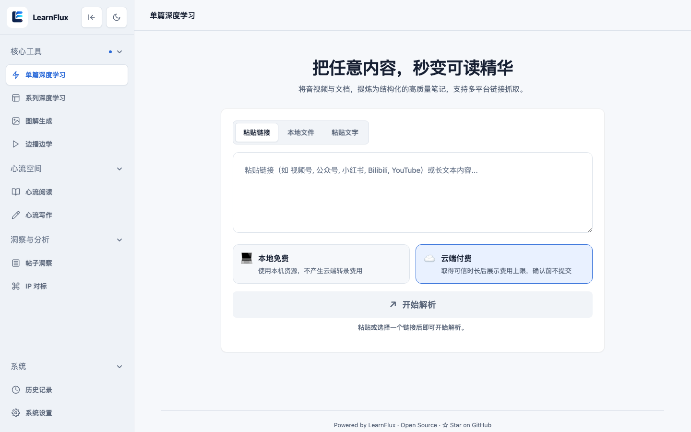
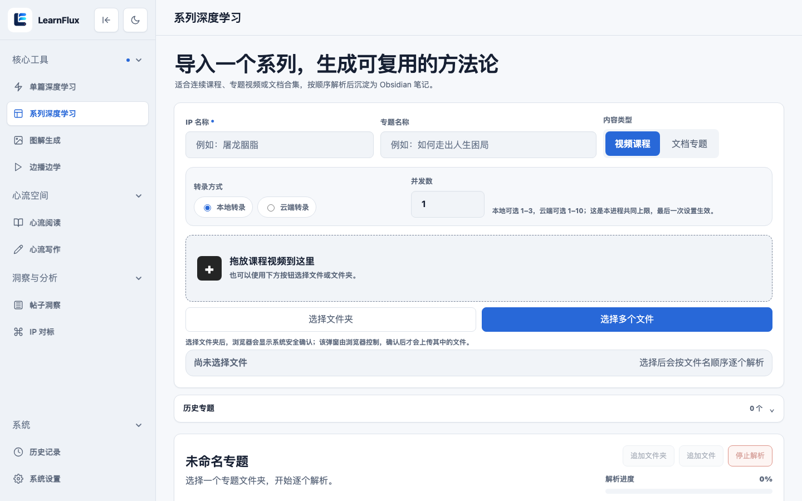
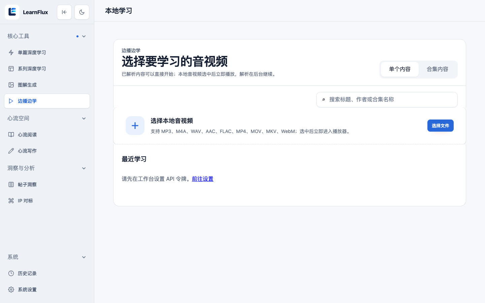
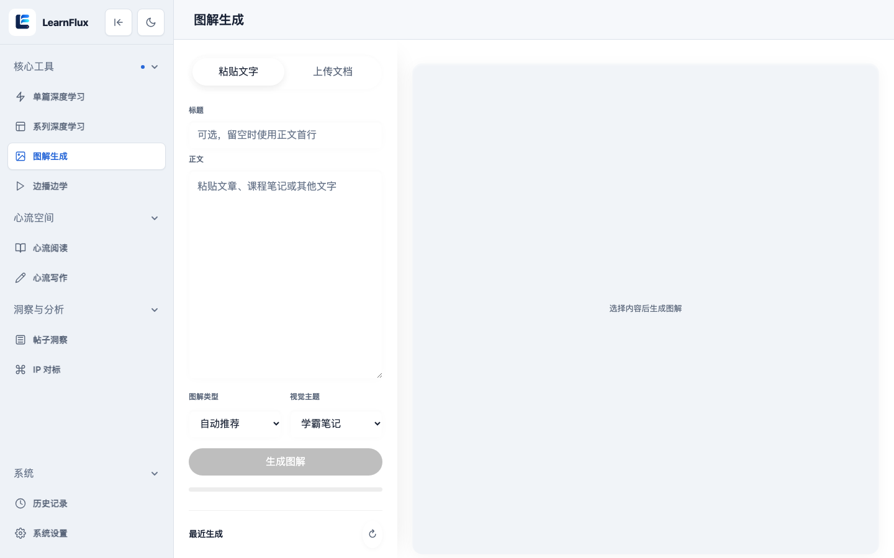
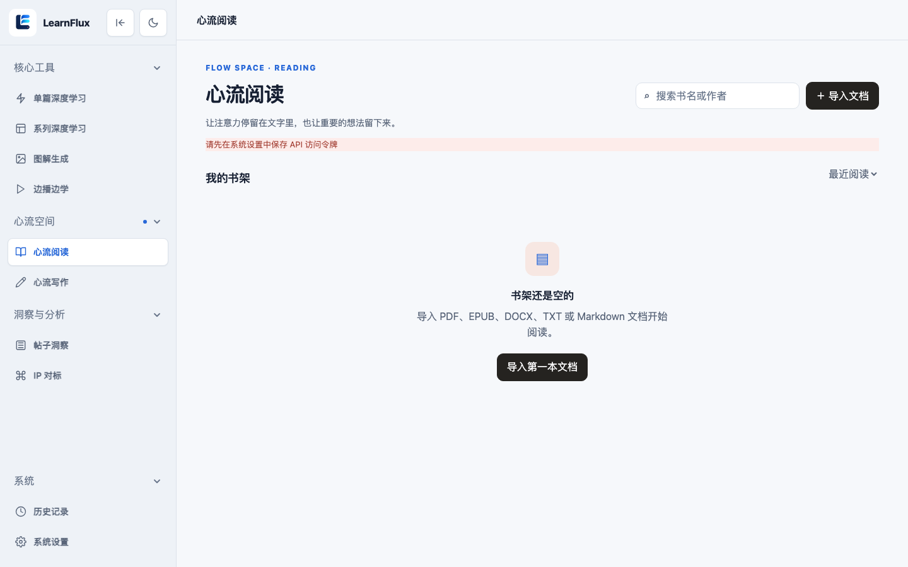
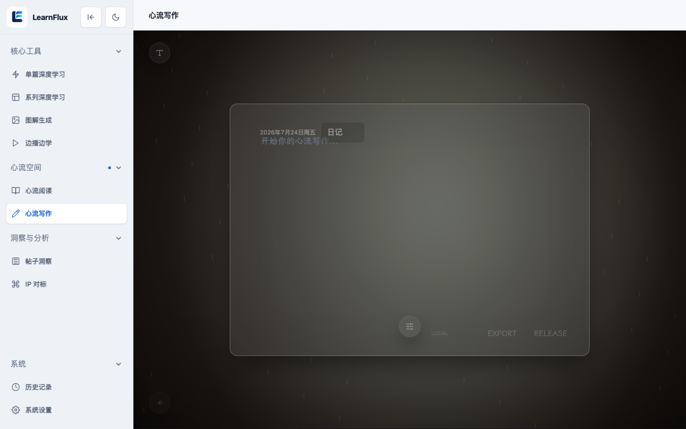
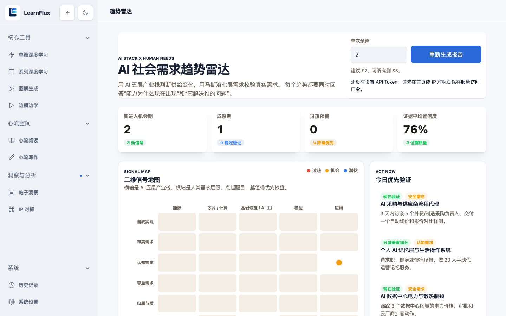
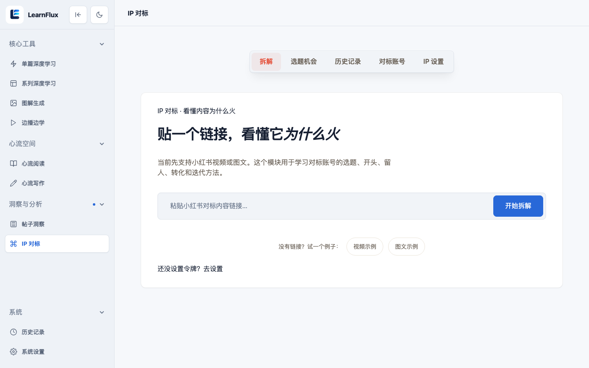
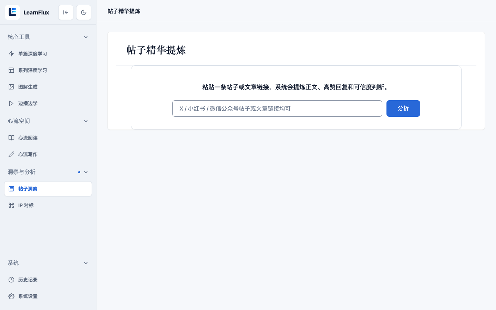
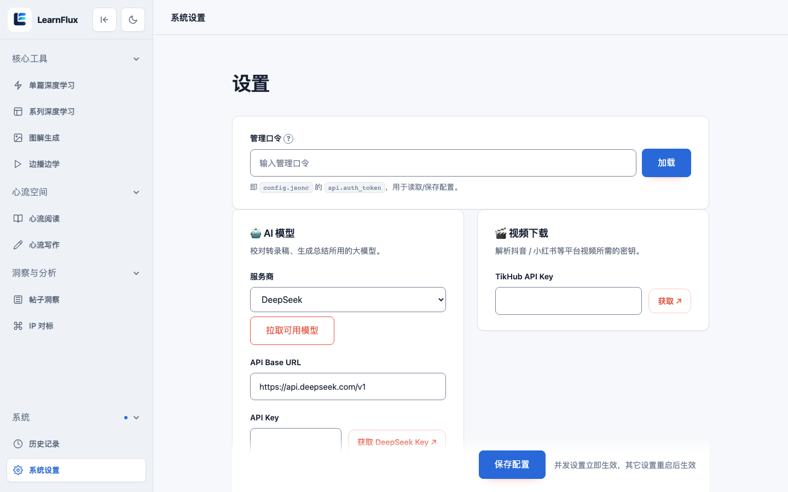

# LearnFlux

> 把视频、音频和文档，变成可理解、可追问、可复习、可沉淀的学习材料。

LearnFlux 是面向个人学习与内容研究的 **AI 学习工作台**。  
导入链接或本地文件后，它不只返回一份转写文本，而是把内容推进到完整学习闭环：

**导入 → 转录 → AI 解读 → 边播边学 / 心流阅读 → 图解与笔记 → 系列知识地图 → Obsidian 沉淀**

<p align="center">
  
</p>

[](https://www.python.org/downloads/)
[](https://fastapi.tiangolo.com/)
[](LICENSE)

---

## 目录

- [适合谁 / 不适合谁](#适合谁--不适合谁)
- [界面预览](#界面预览)
- [学习闭环](#学习闭环)
- [核心能力](#核心能力)
- [先选适合你的安装路径](#先选适合你的安装路径)
- [三分钟启动](#三分钟启动)
- [五分钟完成第一次学习](#五分钟完成第一次学习)
- [配置一次，按需开启能力](#配置一次按需开启能力)
- [转录引擎怎么选](#转录引擎怎么选)
- [启动、检查与停止](#启动检查与停止)
- [Docker 部署](#docker-部署)
- [产品入口地图](#产品入口地图)
- [API 快速示例](#api-快速示例)
- [项目结构](#项目结构)
- [测试](#测试)
- [安全建议](#安全建议)
- [更多文档](#更多文档)
- [开源协议](#开源协议)

---

## 适合谁 / 不适合谁

**适合**

- 想把课程、播客、访谈、长视频变成可复习材料的个人学习者
- 做内容研究、选题、对标账号的创作者与研究员
- 希望本机自托管、数据落在自己磁盘上的用户
- 需要把学习笔记同步到 Obsidian 的知识工作者

**不适合**

- 只想要一个“丢链接返回字幕”的极简 CLI（也能用，但产品重心不在这里）
- 需要开箱即用的多租户商业 SaaS、计费与团队权限体系
- 希望安装脚本自动部署所有 GPU 转录服务（CapsWriter / FunASR 需你自行准备）

---

## 界面预览

以下截图均来自本机运行中的 LearnFlux（1440×900）。

### 核心学习

| 单篇深度学习 | 系列深度学习 |
| :---: | :---: |
|  |  |
| 粘贴链接 / 本地文件 / 文本，本地或云端转录 | 导入系列课程，按顺序解析并沉淀笔记 |

| 边播边学 | 图解生成 |
| :---: | :---: |
|  |  |
| 选择音视频，进入时间轴联动学习 | 粘贴文字或上传文档，生成视觉图解 |

### 心流与洞察

| 心流阅读 | 心流写作 |
| :---: | :---: |
|  |  |
| 沉浸式文档阅读与书架子管理 | 专注写作空间，支持本地草稿 |

| 趋势雷达 | IP 对标 |
| :---: | :---: |
|  |  |
| 主题机会扫描与证据地图 | 拆解对标内容为什么火 |

| 帖子洞察 | 系统设置 |
| :---: | :---: |
|  |  |
| 提炼帖子正文、高赞回复与可信度 | 配置 LLM、TikHub 与管理口令 |

更多页面截图见 [docs/images/](docs/images/)，包括历史记录等。

---

## 学习闭环

```text
链接 / 本地音视频 / 文档
        │
        ▼
   下载与元数据解析
        │
        ▼
  转录（本机 / 局域网 / 云端）
        │
        ▼
 AI 校对 · 总结 · 问答 · 图解
        │
        ├─► 单篇深度学习
        ├─► 边播边学（时间轴联动）
        ├─► 心流阅读 / 心流写作
        ├─► 系列合集与知识地图
        └─► Obsidian Markdown 笔记
```

一句话理解：LearnFlux 把“听过/看过”推进到“理解过、标记过、能回看、能复用”。

---

## 核心能力

### 输入

- 平台链接：YouTube、Bilibili、抖音、小红书、小宇宙、微信视频号
- 本地音视频与文档
- 已有字幕/文本内容（可跳过 ASR，直接进入学习与 AI 解读）

### 理解

- 带时间轴的逐字稿
- AI 校对、总结、难点解释与全文追问
- 视觉图解（把抽象内容变成可浏览的图解材料）
- 帖子/评论洞察、趋势雷达、IP 对标工作台

### 复习与沉淀

- 边播边学：播放进度、字幕、解读、图解与个人笔记联动
- 系列深度学习：合集管理、全系列解读、知识地图
- 心流阅读 / 心流写作：沉浸阅读与写作空间
- Obsidian 同步：把学习笔记落到本地 Vault
- 历史记录：回看已处理内容

---

## 先选适合你的安装路径

| 你的情况 | 推荐路径 | 额外需要的转录服务 |
| --- | --- | --- |
| Apple Silicon Mac，想在本机转录 | LearnFlux + `mlx-whisper` | 不需要 CapsWriter；说话人识别仍可选 FunASR |
| Linux / Windows / 独立服务器 | LearnFlux + CapsWriter | 需要可访问的 CapsWriter WebSocket |
| 不想自建 ASR，接受按量云端 | 开启百炼云端转录（`cloud_asr`） | 需要 DashScope 相关环境变量；先报价后确认 |
| 需要区分说话人 | 任意基础路径 + FunASR | 仅在提交任务时启用“说话人识别”才需要 |
| 只处理已有字幕或文档 | 仅 LearnFlux 本体 | 通常不需要 ASR |

补充说明：

- **LLM** 不是启动服务的硬前提，但决定 AI 校对、总结、问答、图解等能力是否可用。
- **TikHub** 不是启动硬前提，但决定抖音、小红书等部分社媒解析与洞察能力是否可用。
- CapsWriter / FunASR 是独立计算服务，硬件与模型因机器而异，**安装脚本不会猜测式自动部署它们**。

---

## 三分钟启动

需要 Git 与网络。下面的命令会：

1. 安装 Python 依赖（通过 `uv`）
2. 检查并尽量安装 FFmpeg
3. 仅在配置文件不存在时，从模板创建 `config/config.jsonc`
4. **不会覆盖你已有的配置**

```bash
git clone https://github.com/zhangxun-ai/LearnFlux.git
cd LearnFlux
bash scripts/bootstrap.sh
```

等价依赖同步：

```bash
uv sync --extra dev
```

### Apple Silicon Mac：启用本机转录

```bash
bash scripts/bootstrap.sh --with-local-whisper
```

这会把官方 [`mlx-whisper`](https://github.com/ml-explore/mlx-examples/tree/main/whisper) 安装到 `~/.venvs/mlx-whisper`。  
首次真正转录时会下载所选模型。然后在 `config/config.jsonc` 中启用：

```jsonc
"local_whisper": {
  "enabled": true,
  "binary": "~/.venvs/mlx-whisper/bin/mlx_whisper",
  "model": "mlx-community/whisper-large-v3-turbo",
  "language": "",
  "timeout": 1800
}
```

启用后，普通音视频转录优先走本机引擎，不再依赖 CapsWriter。  
该模式不提供说话人识别；如需说话人分段，请继续配置 FunASR。

---

## 五分钟完成第一次学习

目标：从“服务起来了”走到“我看到了第一份学习材料”。

### 1. 启动服务

```bash
./server.sh start
curl -s http://localhost:8000/health
```

浏览器打开：[http://localhost:8000](http://localhost:8000)

### 2. 先填最小配置

进入 **系统设置** `/settings`，至少完成：

| 配置 | 为什么现在就要 |
| --- | --- |
| 管理口令 / `api.auth_token` | Web 与 API 访问鉴权 |
| LLM API Key + Base URL | AI 总结、校对、问答、图解 |
| 转录方式 | 本机 `mlx-whisper`、CapsWriter，或云端 ASR 之一 |
| TikHub（可选） | 抖音 / 小红书等社媒能力 |

密钥只应写在被 Git 忽略的 `config/config.jsonc`，或通过环境变量注入。

### 3. 导入第一份内容

1. 打开 **单篇深度学习** `/add_task_by_web`
2. 粘贴一个公开可访问的 YouTube / Bilibili 链接，或上传本地音视频
3. 先不要开说话人识别，完成一次最短路径
4. 任务成功后进入结果页，查看：
   - 逐字稿
   - AI 总结 / 解读
   - 可继续进入 **边播边学** `/study`

### 4. 你应该看到什么

- 任务状态从排队/处理，最终到成功
- 结果页有可阅读文本，而不是空白
- 若配置了 LLM，会出现总结或解读区块
- 若源内容是音视频且 ASR 正常，会有时间轴字幕可联动回放

如果卡在转录阶段，优先检查：

```bash
curl -s http://localhost:8000/health
./server.sh log
```

`/health` 会反映本机 Whisper、远程 CapsWriter / FunASR 等依赖状态。

---

## 配置一次，按需开启能力

```bash
cp config/config.example.jsonc config/config.jsonc
```

`bootstrap.sh` 在文件不存在时也会自动做这一步。

### 高频配置项

| 配置 | 何时需要 | 说明 |
| --- | --- | --- |
| `api.auth_token` | 建议始终设置 | Web/API 管理口令与 Bearer Token |
| `llm.api_key`、`llm.base_url` | AI 能力 | 任意 OpenAI 兼容服务 |
| `tikhub.api_key` | 抖音、小红书、部分洞察 | 在 [TikHub](https://user.tikhub.io/register?referral_code=YArXsaWi) 获取 |
| `local_whisper.*` | Apple Silicon 本机转录 | 启用后优先于 CapsWriter |
| `capswriter.server_url` | 未启用本机 Whisper 时 | 默认 `ws://localhost:6016` |
| `funasr_spk_server.server_url` | 说话人识别 | 默认 `ws://localhost:8767` |
| `cloud_asr.*` | 云端按量转录 | 密钥走环境变量，不写进配置文件 |
| `obsidian.enabled` / `vault_path` | 笔记同步 | 绑定本机 Obsidian Vault |

### 远程或局域网转录服务

非 Apple Silicon 环境可部署或连接已有 [CapsWriter-Offline](https://github.com/HaujetZhao/CapsWriter-Offline)：

```jsonc
"capswriter": {
  "server_url": "ws://YOUR_ASR_HOST:6016"
}
```

需要按说话人分段时，另行部署 [funasr_spk_server](https://github.com/zj1123581321/funasr_spk_server)：

```jsonc
"funasr_spk_server": {
  "server_url": "ws://YOUR_ASR_HOST:8767"
}
```

### 云端转录（可选）

`cloud_asr` 默认关闭。启用后由阿里云百炼等提供商处理普通转录；  
相关密钥只从环境变量读取（如 `DASHSCOPE_API_KEY`），**不要写入 `config.jsonc`**。  
产品流程会先展示可信报价，用户确认后再提交付费调用。

---

## 转录引擎怎么选

| 引擎 | 适合场景 | 优点 | 注意 |
| --- | --- | --- | --- |
| `local_whisper`（mlx） | M 系列 Mac 个人使用 | 数据本机、依赖少 | 首次下模型；无说话人识别 |
| CapsWriter | Linux/服务器/局域网 | 成熟、可独立扩容 | 需单独部署 WebSocket 服务 |
| FunASR 说话人 | 访谈、会议、多角色内容 | 可按说话人分段 | 仅按需开启 |
| `cloud_asr` | 不想维护本地 ASR | 免本地模型 | 有费用；需确认报价 |

经验建议：

1. **Mac 个人学习**：先 `local_whisper`
2. **长期服务器**：CapsWriter + 可选 FunASR
3. **临时高峰 / 无 GPU**：再考虑云端 ASR

---

## 启动、检查与停止

```bash
./server.sh start
./server.sh status
./server.sh log
./server.sh restart
./server.sh stop
```

默认地址：`http://localhost:8000`  
改完 `config/config.jsonc` 后执行 `./server.sh restart` 使配置生效。

健康检查：

```bash
curl -s http://localhost:8000/health
```

交互式 API 文档：

- Swagger UI：`http://localhost:8000/docs`

---

## Docker 部署

镜像已包含 FFmpeg、BBDown、yt-dlp 等运行依赖；**转录服务仍需独立提供**。

```bash
cp config/config.example.jsonc config/config.jsonc
# 编辑 config/config.jsonc：填写 token、LLM、ASR 地址等
cd docker
docker compose up -d --build
```

默认端口映射为 **宿主 `8200` → 容器 `8000`**，因此访问：

- Web：`http://localhost:8200`
- Health：`http://localhost:8200/health`

Compose 会挂载：

- `../config` → 配置
- `../data` → 缓存、日志、任务结果等持久化数据

重要提醒：

- 容器访问宿主机 ASR 时，**不要写容器内的 `localhost`**
- 请使用宿主机 IP、局域网地址，或 `host.docker.internal`
- 镜像标签：`ghcr.io/zhangxun-ai/learnflux:latest`

---

## 产品入口地图

与侧边导航一致：

### 核心工具

| 页面 | 路径 | 用途 |
| --- | --- | --- |
| 单篇深度学习 | `/add_task_by_web` | 导入链接/文件，完成转写与 AI 解读 |
| 系列深度学习 | `/collections` | 合集管理、系列解读、知识地图 |
| 图解生成 | `/visual-learning` | 把内容变成视觉图解 |
| 边播边学 | `/study` | 时间轴联动的学习播放器 |

### 心流空间

| 页面 | 路径 | 用途 |
| --- | --- | --- |
| 心流阅读 | `/reading` | 沉浸式阅读 |
| 心流写作 | `/static/focus-studio.html` | 写作与专注空间 |

### 洞察与分析

| 页面 | 路径 | 用途 |
| --- | --- | --- |
| 帖子洞察 | `/post` | 帖子/评论结构化洞察 |
| 趋势雷达 | `/trend-radar` | 主题趋势与机会扫描 |
| IP 对标 | `/flywheel` | 账号与内容飞轮研究 |

### 系统

| 页面 | 路径 | 用途 |
| --- | --- | --- |
| 历史记录 | `/static/history.html` | 回看已处理任务 |
| 系统设置 | `/settings` | LLM、TikHub、通知等配置 |

---

## API 快速示例

单用户模式下，Bearer Token 即 `config/config.jsonc` 中的 `api.auth_token`。  
多用户模式请参考 [多用户配置](docs/guides/multi_user_setup.md)。

```bash
# 1) 提交任务
curl -X POST "http://localhost:8000/api/transcribe" \
  -H "Authorization: Bearer your-auth-token" \
  -H "Content-Type: application/json" \
  -d '{
    "url": "https://www.youtube.com/watch?v=xxx",
    "use_speaker_recognition": false
  }'

# 2) 查询状态
curl -s "http://localhost:8000/api/task/<task_id>" \
  -H "Authorization: Bearer your-auth-token"
```

更完整的客户端接入流程（提交 → 轮询 → 取结果）见：

- [API Quick Start](docs/guides/api/quickstart.md)
- 运行中的 OpenAPI：`/docs`

---

## 项目结构

```text
LearnFlux/
├── main.py                        # 入口
├── server.sh                      # 本机启停
├── scripts/bootstrap.sh           # 新环境初始化
├── config/
│   └── config.example.jsonc       # 配置模板（真实密钥不入库）
├── docker/                        # Docker Compose 与镜像
├── src/
│   ├── video_transcript_api/      # 后端核心（历史包名，兼容保留）
│   │   ├── api/                   # FastAPI 路由与服务
│   │   ├── downloaders/           # 平台下载适配
│   │   ├── transcriber/           # 本机 / 远程 / 云端转录
│   │   ├── study/                 # 学习播放与资料库
│   │   ├── visual_learning/       # 图解学习
│   │   ├── obsidian/              # Obsidian 同步
│   │   ├── collections/           # 系列合集
│   │   └── ...
│   └── web/                       # 前端页面、静态资源、模板
├── tests/                         # pytest 测试
├── data/                          # 运行时数据（Git 忽略）
└── docs/                          # 架构、指南与设计文档
```

说明：产品名是 **LearnFlux**；Python 包路径仍为 `video_transcript_api`，这是历史兼容选择，不影响使用。

---

## 测试

```bash
# 快速单元测试
uv run --extra dev pytest tests/unit

# 默认离线测试套件
uv run --extra dev pytest
```

功能、集成、LLM、平台、手动和性能测试可能需要网络、真实凭据或外部服务，请按 [tests/README.md](tests/README.md) 指定文件单独运行。

---

## 安全建议

- 永远不要提交真实的 `config/config.jsonc`、`.env` 或 API Key
- 公网暴露前务必设置强 `api.auth_token`，并配合反向代理 / HTTPS
- 转录结果、缓存和日志默认落在 `data/`，部署时注意磁盘权限与备份
- 云端 ASR 密钥只放环境变量，不要写进配置文件
- 处理他人内容时，遵守平台条款与版权要求

---

## 更多文档

| 文档 | 说明 |
| --- | --- |
| [文档中心](docs/README.md) | 全部文档导航 |
| [系统架构](docs/architecture.md) | 模块与数据流 |
| [API Quick Start](docs/guides/api/quickstart.md) | 下游客户端接入 |
| [通知配置](docs/guides/notification.md) | 企微 / 飞书等通知 |
| [多用户配置](docs/guides/multi_user_setup.md) | 多 Key / 多用户 |
| [FunASR 客户端 API](docs/guides/api/funasr_spk_server_client_api.md) | 说话人识别服务接口 |

设计稿与阶段性方案在 `docs/superpowers/`；以代码和 `config.example.jsonc` 为最终事实来源。

---

## 开源协议

基于 **MIT + Commons Clause** 开源。

- 允许：个人学习、研究、修改、非商业分发
- 禁止：售卖，或将本软件作为主要价值提供给第三方并收费（含相关托管/支持服务）

完整条款见 [LICENSE](LICENSE)。

---

## 反馈与贡献

如果你在使用中遇到：

1. 某平台链接解析失败
2. 转录成功但 AI 解读空白
3. Docker 下连不上 ASR
4. 希望补充截图、英文 README 或部署案例

欢迎提 Issue，或直接贡献 PR。提交代码前建议至少跑通：

```bash
uv run --extra dev pytest tests/unit
```

---

**下一步建议**：先按「三分钟启动 + 五分钟第一次学习」跑通一条公开视频，再按需打开合集、图解、Obsidian 与洞察能力。
```