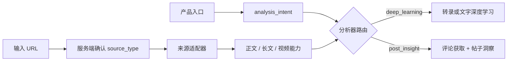

# 分析意图优先的内容路由设计

## 目标与不可变规则

LearnFlux 的产品入口决定分析意图，内容来源只决定获取适配器：

- 单篇深度学习入口固定为 `analysis_intent=deep_learning`；
- 帖子洞察入口固定为 `analysis_intent=post_insight`；
- `source_type` 不得改变入口、结果页、历史导航或分析器；
- 任何跨功能切换都必须由用户显式操作，不能因 URL 自动跳转；
- 深度学习绝不获取或分析评论，帖子洞察才获取评论并运行社交运营分析。

这组规则覆盖所有当前及未来来源，包括微信公众号、小红书、微信视频号、抖音、
YouTube、X/Twitter、直接媒体和未知但可处理的链接，不再按平台追加跳转特例。
平台支持矩阵只能描述“能否获取正文、字幕或媒体”，不能描述“应该进入哪个产品
功能”。

## 已验证的底层原因与影响范围

旧版首页的 `classifyContent()` 同时承担来源识别、产品类型和历史类型推断。
X/Twitter 的 `/status/<id>`（包括 `/video/1`）被标记为 `post`，随后
`submitTranscription()` 直接导航到 `/post?url=...`。当前运行在
`localhost:8000` 的进程来自原始 checkout，仍在提供这版静默跳转代码。

工作树中上一阶段已经删除提交时跳转，但全局耦合尚未完全消除：

- `classifyContent()` 在深度学习意图下仍把 X 表示为 `type=post`；
- `histTypeOf()` 在缺字段时按 URL 推断为帖子；
- `buildHistoryCard()` 根据 URL 推断失败重试和无结果条目的目标页面；
- 后端 `URLParser` 能识别 X，但下载器工厂没有 X 适配器，最终由
  `GenericDownloader` 处理网页并失败；
- 现有 `TwitterPostFetcher` 使用评论接口同时获取正文和回复，不能直接作为
  深度学习来源适配器，否则会造成语义与费用再次耦合。

GitNexus 的上游影响检查显示：

- `classifyContent` 直接影响提交文案、检测、提交、历史分类和历史卡片；
- `histTypeOf` 直接影响 7 个历史/轮询调用者，四层内影响 21 个符号，风险为
  MEDIUM；
- `TwitterPostFetcher` 三层内只影响帖子洞察服务与测试，适合保持兼容；
- `process_transcription` 是下载、缓存、ASR、LLM 和通知的共享编排点，修改需以
  定向测试覆盖 X 视频和文字两条路径。

## 方案比较

### 方案 A：只删除前端跳转

可以消除眼前跳转，但历史记录仍会重建帖子语义，X 链接进入后端也会下载失败。
不能满足“不再互相影响”。

### 方案 B：为 X 增加入口特判和专用后端分支

能处理当前链接，但会重复公众号时期的域名特判。以后新增来源仍可能重新把
来源与产品意图混在一起。

### 方案 C：意图优先 + 来源能力适配（采用）

前端展示、任务、历史和结果导航都读取已保存的 `analysis_intent`；服务端为 X
新增不含评论的来源适配器，向深度学习管线暴露“正文”和“可下载视频”能力。
帖子洞察继续复用自己的评论抓取与分析服务。该方案建立全局边界，同时不要求
本轮迁移全部平台或重建任务数据库。

## 数据流

### 全平台入口契约

深度学习入口对所有来源执行同一个产品流程：

| 来源 | 内容获取能力 | 获取后统一去向 |
| --- | --- | --- |
| 微信公众号 | 文章正文 | 深度学习任务与 `/view` |
| 小红书 | 图文正文或视频 | 深度学习任务与 `/view` |
| 微信视频号 | 视频 | 深度学习任务与 `/view` |
| 抖音 | 视频/平台元数据 | 深度学习任务与 `/view` |
| YouTube | 字幕或视频 | 深度学习任务与 `/view` |
| X/Twitter | 正文、长文或视频 | 深度学习任务与 `/view` |
| 直接媒体/其他可处理链接 | 音视频或正文 | 深度学习任务与 `/view` |

同一个来源 URL 如果由帖子洞察入口显式提交，才进入帖子洞察服务。来源适配器可以
共享，入口、分析器、历史类型和结果页不能共享或互相推断。
如果帖子洞察尚不支持该来源，则在帖子洞察产品内明确返回 unsupported；不能创建
深度学习任务或跳转到深度学习入口。

### 前端与历史

`classifySource()` 只输出来源。`classifyContent(url, analysisIntent)` 仅生成当前
入口的展示模型，顶层 `type/historyType` 必须由 `analysisIntent` 决定：

- `deep_learning` 任务统一属于学习历史，结果为 `/view/<view_token>`；
- `post_insight` 任务统一属于帖子洞察历史，结果为显式持久化结果；
- 旧历史缺少意图时，仅可从稳定结果标识和已存类型兼容，不得用社交域名把
  学习任务导航到 `/post`；
- 深度学习失败重试返回深度学习工作台；帖子洞察失败重试返回帖子洞察页。

`source_type` 仍用于来源徽标、控件能力和后端适配提示，但不能产生产品跳转，
也不能选择 LLM summary profile。客户端字段只作 acquisition hint；worker 根据
canonical URL 和实际适配器产出服务端确认的 `content_kind`：

- `article_text`
- `social_text`
- `subtitle`
- `video`
- `audio`
- `direct_media`

`content_kind` 只选择正文、字幕、下载或 ASR 等预处理能力，不选择产品分析器。
深度学习工作台不展示评论洞察开关，提交始终发送 `include_comments=false`。

### X 来源适配器

新增 `TwitterDownloader`，使用 `urlsplit()` 严格识别 hostname 等于 `x.com`、
`www.x.com`、`twitter.com`、`www.twitter.com` 或 `mobile.twitter.com` 且路径为
`/<user>/status/<id>` 的链接；允许其后出现 `/video/<n>`，拒绝 userinfo、
lookalike host 和未允许的子域。适配器只调用 TikHub
`GET /api/v1/twitter/web/fetch_tweet_detail`。官方接口文档公开了
`data.media_playable_url` 和 `data.media` 的可播放媒体信息。

适配器输出：

- `video_id`：状态 ID；
- `title`、`author`、`description`：推文或 X Article 正文；
- `download_url`：仅接受明确的 `video/mp4`、视频类型媒体，或 URL 路径明确为
  `.mp4` 的候选；拒绝图片和任意 media URL；
- 无视频时 `download_url=None`，由文字深度学习路径消费正文；
- 不调用 `fetch_post_comments`，不获取第三方回复。

对于带视频的 X：

1. 获取一次详情；
2. 下载并转录视频；
3. 将推文正文作为描述上下文传给深度学习摘要；
4. 使用稳定 `/view/<view_token>` 结果。

对于无视频的 X：

1. 获取推文正文或 X Article 正文；
2. 保存为文字来源缓存；
3. 使用文章型深度学习输出契约；
4. 不进入 ASR，也不进入帖子洞察。

帖子洞察继续使用 `TwitterPostFetcher.fetch()`、评论筛选、需求挖掘和
`PostInsightAnalyzer`。两个功能只共享底层 TikHub 请求能力和 URL 解析，不共享
分析器、任务入口或结果页。

### 服务端防线

- `/api/transcribe` 仅接受 `analysis_intent=deep_learning`；
- `/api/post-insight` 是唯一帖子洞察入口；
- worker 不信任客户端 `source_type` 或 `URLParser.platform` 选择分析器，以
  canonical URL 和实际 `TwitterDownloader` 能力对象判断 X 路径；
- LLM 队列继续携带 `analysis_intent`、服务端确认的 `source_type` 和
  `content_kind`，不透传客户端伪造值；
- 所有 `analysis_intent=deep_learning` 任务统一使用深度学习 summary profile；
  profile 不依赖平台或 `source_type`；
- 所有深度学习请求在 URL 解析和缓存判断之前统一派生
  `effective_include_comments=False`，缓存判定和全部 LLM payload 只使用该值；
- `llm_ops` 再执行防御性归一化，即使内部 payload 被伪造为
  `analysis_intent=deep_learning + include_comments=true`，也不能进入补评论或
  评论分析分支；
- TikHub 403/scope 错误直接脱敏失败，不绕过权限。

### 历史恢复与持久化边界

新提交的浏览器记录和任务队列显式携带 `analysis_intent`。本轮不修改数据库
schema，因此 `/api/audit/history` 的旧记录可能没有该字段。恢复规则是：

- 有 `result_id` 的显式帖子洞察记录恢复为 `post_insight`；
- 有 `view_token` 或来自转录审计端点的记录恢复为 `deep_learning`；
- 合并本地历史与 server-synced/marked 记录时保留已有 `analysis_intent`；
- 不允许依据 X、公众号或任何平台字段把缺失意图的转录记录恢复为帖子洞察。

这里承诺的是“本地记录/队列显式携带 + 后端结果不变量恢复”，不声称本轮完成
数据库字段迁移。

## 错误与费用语义

- X 详情无正文且无视频：任务失败并明确提示“未获取到可学习内容”；
- 有视频地址但下载失败：报告视频获取/下载失败，不伪装成文字视频总结；
- 视频字段结构未知：仅接受明确的 MP4/视频类型候选，不把图片当视频；
- 无视频但有正文：明确进入文字深度学习，不报转录失败；
- 重看稳定 `/view` 结果不重新请求 TikHub/LLM；
- 同一个任务的 metadata 与 download info 复用适配器实例详情缓存，只请求一次
  X detail；部分缓存只补 LLM，完整缓存和成功后的串行重提不重新请求 X detail
  或创建 LLM 工作；
- 帖子洞察的预填 URL 不自动分析，只有用户点击分析才产生费用。

并发冷提交在首个结果落盘前的 in-flight 合并不在本轮保证范围。

## 测试策略

1. Node 参数化测试覆盖公众号、小红书、视频号、抖音、YouTube、X
   `/status/.../video/1?s=46` 和未知来源，证明深度学习入口始终保持
   `analysis_intent=deep_learning`，无 `/post` 导航。
2. 历史测试证明多个相同来源在两个显式意图下导航到各自结果，URL 本身不能改变
   意图；server-synced/marked X 转录记录和旧深度学习结果也不会因域名被当作帖子。
3. 下载器单元测试覆盖严格主机边界、userinfo/lookalike/子域负例、状态 ID、
   正文/Article、明确接受的视频字段与拒绝的图片/任意 URL，且不调用评论接口。
4. worker 测试覆盖 X 视频继续下载+ASR，X 文字直接入 LLM；伪造
   `source_type`/`URLParser platform` 不能进入 X helper。
5. 全平台 `source × intent` 合同矩阵证明：所有 `/api/transcribe` 来源保持
   深度学习；帖子洞察支持的来源留在帖子产品，不支持的来源在帖子产品内明确
   unsupported；两者都不互相回退或跳转。
6. 伪造每个平台的客户端 `source_type` 不能改变服务端确认的来源、
   `content_kind`、分析器或 summary profile；所有深度学习来源使用同一学习
   profile。
7. 冷缓存、部分缓存、完整缓存测试覆盖公众号、小红书图文/视频、视频号、抖音、
   YouTube、X 视频/文字、直接媒体和 unknown 传入
   `include_comments=true` 仍被全链路关闭；伪造 LLM payload 也不能调用评论
   fetcher/analyzer。
8. X 缓存测试证明单任务详情只请求一次，部分/完整缓存和串行重提不重复产生来源
   获取或 LLM 费用。
9. 错误测试证明：视频下载失败不能回退正文伪装成功；空正文且无视频时失败且无
   cache/LLM；图片不被当作视频；只有无视频且正文非空才进入文字 helper。
10. API 合同测试证明 `/api/transcribe` 拒绝 `post_insight`，帖子洞察使用独立接口。
11. 运行相关单元测试、JS 语法检查、必要的本地 UI 测试和 GitNexus
   `detect_changes`，最后检查未提交差异。

## 本轮边界

本轮实现最小完整纵向切片，不迁移数据库 schema，不统一重写所有已有下载器，
不承诺并发提交的 in-flight 合并，不重启另一个 checkout 的服务，不提交、推送
或部署。后续来源接入必须复用同一规则，不得重新引入“平台等于分析意图”。
